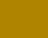
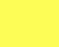

# MACILE's branding guide

### Logo

### Tipografía

1. `Trajan Pro Bold`

2. `Trajan Pro Regular` 

### Colores

1. **Azul**

- Hex `1a1451`
- RGB `26, 20, 81`

2. **Dorado**

- Hex `af8400`
- RGB `175, 132, 0`

3. **Amarillo**

- Hex `fdfd56`
- RGB `253, 253, 86`

4. **Gris**

- Hex `606060`
- RGB `96, 96, 96`

