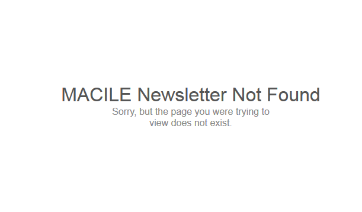
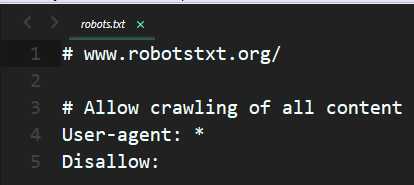
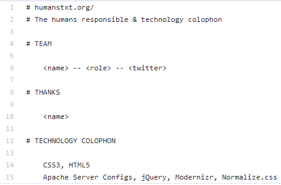

# Documentos necesarios para publicar una página

## [Error page](http://www.404errorpages.com/)

Es el archivo nombrado `404`. Es un archivo de `html`.

Es la página que el usuario ve cuando intenta acceder a una página 
inexistente en tu sitio web. Esto sucede cuando ha hecho click en un enlace 
roto, la página ha sido eliminada o ha escrito mal un URL.

Esta página es importante, porque no deja al usuario en el aire. Sino que lo ayuda
a encontrar lo que está buscando.

Ejemplo:

## [robots.txt](https://www.robotstxt.org)

Este archivo le dice a los rastreadores de máquinas de búsqueda qué páginas o archivos puede o no leer en tu sitio web.

Antes de que un robot visite el sitio web, primero lee el `robots.txt` que contiene dicho sitio. Ejemplo:

`User-agent: *` indica que la sección se aplica a todos los robots. En este caso `Disallow: ` está indicando que el robot puede visitar cualquier página dentro del sitio web. Para indicar lo contario (que no visite ninguna página en el sitio web) se coloca `Disallow: /`.

### Puntos a considerar cuando utilizamos `robots.txt`

1. Algunos robots(como malware robots) pueden ignorar tu `robots.txt`.
2. El archivo `robots.txt` es público, así que no trates de esconder ningún tipo de información.

## [human.txt](http://humanstxt.org/)

Es una iniciativa para reconocer a quién desarrolló el sitio web y las herramientas
que utilizó.

Ejemplo:

Este documento fue inspirado por `robots.txt`. Porque el internet es para humanos, pero hacemos archivos para que los robots de búsqueda. Entonces, debe haber uno también para los humanos.  

**Nota:** Todos estos archivos son colocados en la raíz del sitio web. Al mismo nivel
del `index.html`. 