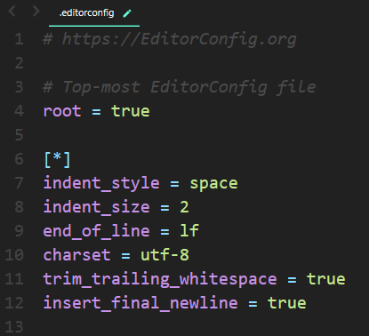

## ¿Qué es [EditorConfig](https://editorconfig.org)?

EditorConfig es un formato de archivo y una colección de complementos de editor de texto para mantener estilos de codificación consistentes entre diferentes editores e IDEs.

Ejemplo de un archivo `.editorconfig`

**root**: es una propiedad especial que debe especificarse en la parte superior del archivo fuera de cualquier sección. Debes darle un valor "true" para detener la búsqueda de archivos .editorconfig en el archivo actual.

`[*]` indica que las propiedades se aplican a todos los caracteres, excepto a los separadores de rutas (/).

## EditorConfig en VSCode y SublimeText

### VSCode

VSCode utiliza el *editorconfig npm package*.

- Instala el paquete `ext install EditorConfig`

**Propiedades que soporta:**

    indent_style
    indent_size
    tab_width
    end_of_line (guardado)
    insert_final_newline (guardado)
    trim_trailing_whitespace (guardado)

**Nota:** algunas propiedades solo pueden ser aplicadas en archivos guadados, como se indica arriba.

Puedes crear un archivo .editorconfig haciendo click derecho en el botón *Explorar*, en la barra de menú. Luego seleciona *Generar .editorconfig*. 
 

### SublimeText

- Instala el `EditorConfig` con el Package Control y reinicia el editor.

**Propiedades que soporta:**

    root
    indent_style
    indent_size
    end_of_line
    charset
    trim_trailing_whitespace
    insert_final_newline

