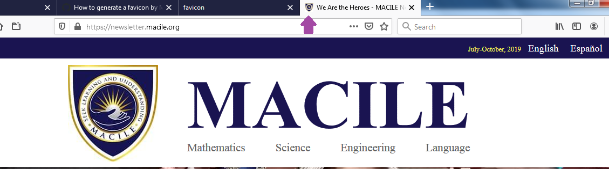
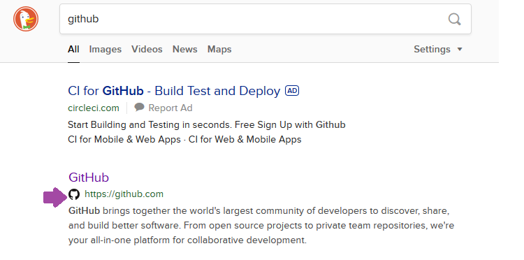
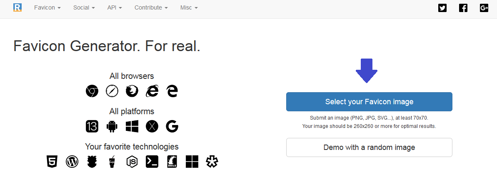
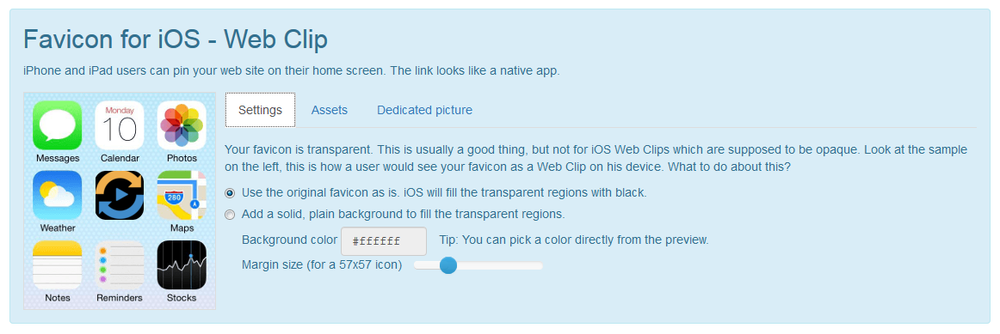
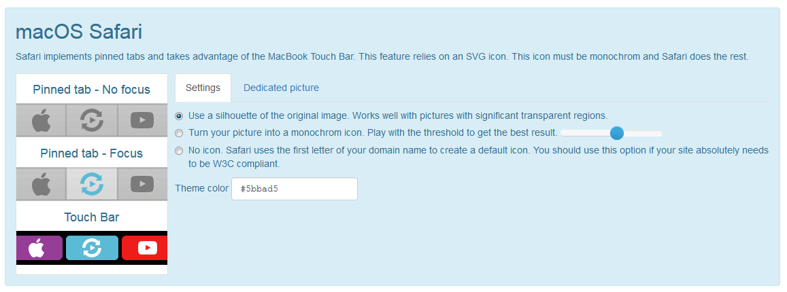
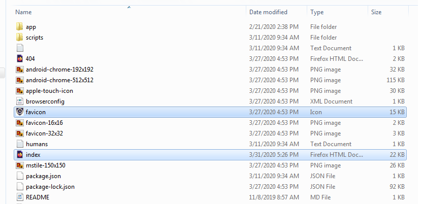

# ¿Qué es un favicon?

**Favicon** (*favorite* + *icon*) es una imagen pequeña que representa un sitio web. Es también conocido como shortcut icon, website icon, tab icon, URL icon, o bookmark icon. También es el icono que identifica una página cuando es añadida a un escritorio de una computadora o un dispositivo móvil.

El favicon es fundamental para el reconocimiento de una página web en un navegador lleno de pestañas, ayuda a expandir la marca de un sitio web. 

Ejemplos:



Algunos motores de búsqueda también incorporan favicons en los resultados de búsqueda. 



Los favicons ayudan a los usuarios a recordar un sitio mientras navegan a través de múltiples URLs y a reconocer fácilmente los sitios web; ya sea en el historial de navegación, los resultados de búsqueda.


# Cómo generar un Favicon para tu sitio web

1. Ir a [Favicon Generator](https://realfavicongenerator.net/)

2. Selecciona la imagen



3. Especifica los ajustes necesarios







4. Ir a **Favicon Generator Options** en la misma página
y genera el favicon

**Nota:** Asegúrate de realizar los ajustes necesarios


5. Descarga el paquete


**Nota:** Una vez descargado el paquete, extrae los archivos y colócalos
en la raíz del sitio web. Es decir, colocarlos al mismo nivel del `index.html`

Por ejemplo



6. Copia las líneas de código que indican y pégalas en `head` en el `index.html`

```html
<link rel="apple-touch-icon" sizes="180x180" href="/apple-touch-icon.png">
<link rel="icon" type="image/png" sizes="32x32" href="/favicon-32x32.png">
<link rel="icon" type="image/png" sizes="16x16" href="/favicon-16x16.png">
<link rel="manifest" href="/site.webmanifest">
<link rel="mask-icon" href="/safari-pinned-tab.svg" color="#5bbad5">
<meta name="msapplication-TileColor" content="#da532c">
<meta name="theme-color" content="#ffffff">

```

*Nota:* esto es un ejemplo, se recomienda copiar las líneas de código que ofrece el generator.

7. [Check your Favicon](https://realfavicongenerator.net/favicon_checker) para ver los detalles de cómo va a lucir tu favicon o verificar que no hay ningún problema. (en caso de que haya, te indica)

No es obligatorio añadir un favicon. En caso de que tu sitio no tenga uno, el navegador mostrará el predeterminado, que es un documento en blanco o nada. Pero lo más recomendado es tenerlo, ya que ayuda a generar credibilidad de tu sitio, especialmente cuando los usuarios lo comparen con otros competidores. 