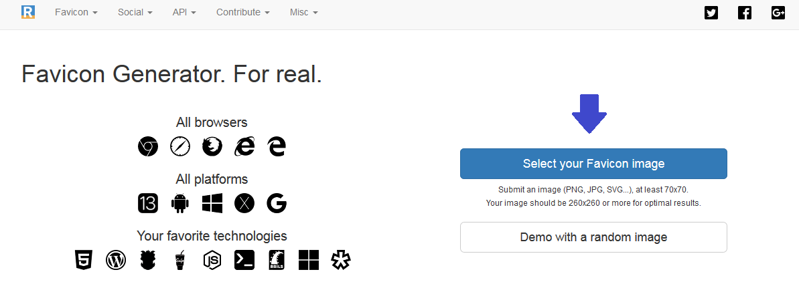
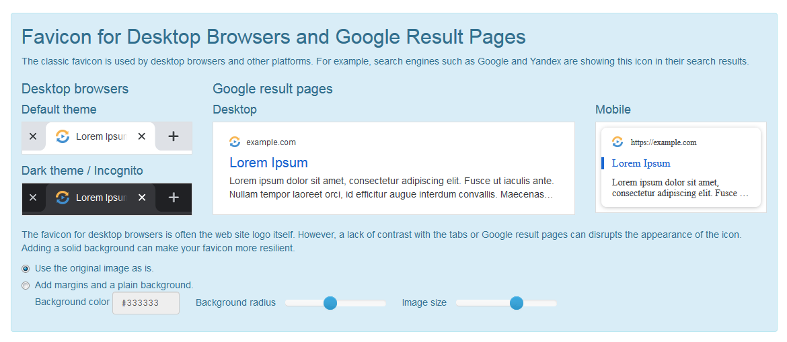
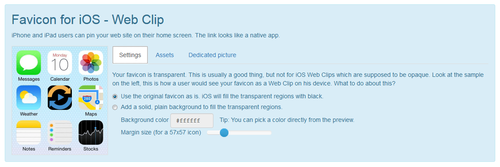
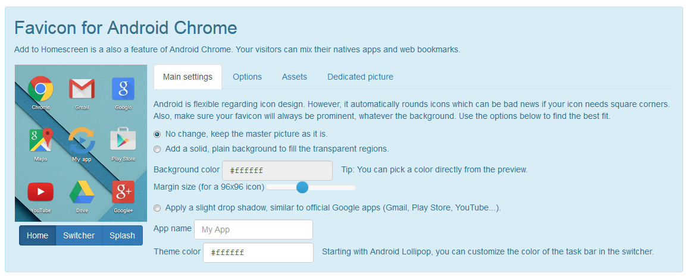
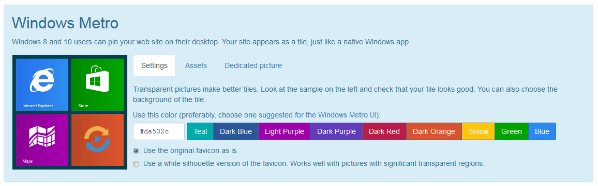
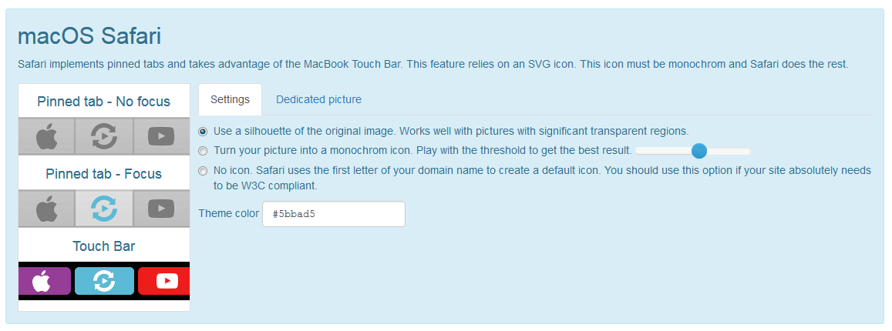
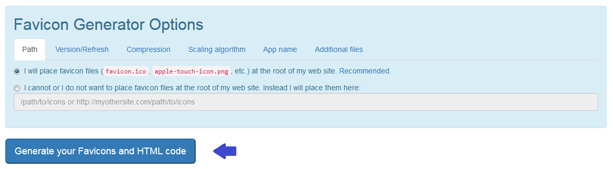
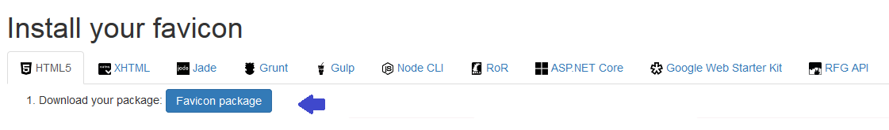

# Cómo generar un favicon

1. Ir a [Favicon Generator](https://realfavicongenerator.net/)

2. Selecciona la imagen



3. Especifica los ajustes necesarios








4. Ir a **Favicon Generator Options** en la misma página
y genera el favicon

**Nota:** Asegúrate de realizar los ajustes necesarios



5. Descarga el paquete



**Nota:** Una vez descargado el paquete, extrae los archivos y colócalos
en la raíz del sitio web. Es decir, colocarlos al mismo nivel del `index.html`


6. Copia las líneas de código que indican y pégalas en `head` en el `index.html`

```
	<link rel="apple-touch-icon" sizes="180x180" href="/apple-touch-icon.png">
	<link rel="icon" type="image/png" sizes="32x32" href="/favicon-32x32.png">
	<link rel="icon" type="image/png" sizes="16x16" href="/favicon-16x16.png">
	<link rel="manifest" href="/site.webmanifest">
	<link rel="mask-icon" href="/safari-pinned-tab.svg" color="#5bbad5">
	<meta name="msapplication-TileColor" content="#da532c">
	<meta name="theme-color" content="#ffffff">

```

7. [Check your Favicon](https://realfavicongenerator.net/favicon_checker)