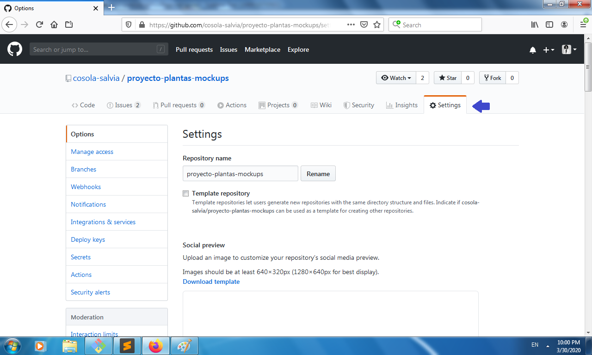

# Cómo publicar una página en GitHub

**Nota:** Si no sabes configurar Git puedes leer la guía 
[Configurar Git](https://help.github.com/es/github/getting-started-with-github/set-up-git)

1. Crea el repositorio para el proyecto que quieres publicar

2. Sube tu código al repositorio

**Nota:** El `index.html` es lo que será publicado como la página principal.
En caso de que no haya un `index.html`, GitHub busca por `README.md`.

3. Ve a los `ajustes`

**Nota:** Asegúrate de estar en el mismo repositorio 

4. Ve a la sección de *GitHub Pages* y selecciona la rama con la que quieres
publicar tu página. 

Puedes usar the default branch `master` o crear una de GitHub `gh-pages`

5. Visita tu página en el link que donde te indica GitHub

