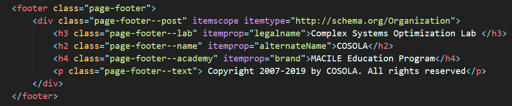
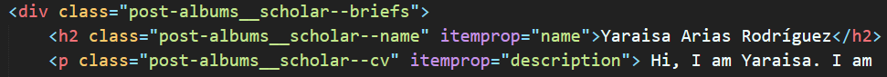
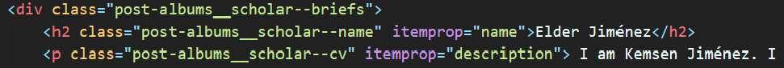

# Cómo utilizar `schema.org`

Schema.org provee una colección de vocabularios compartidos 
que puedes utilizar para que las máquinas de búsqueda puedan entender tu página web.

Vamos a utilizar un ejemplo:

`itemscope` indica que, lo que está dentro del bloque `
...
` 
es un elemento en particular.

`itemtype` especifica el tipo de elemento que se está utilizando.
se coloca después del `itemscope`.

`itemprop` especifica las propiedades del elemento. 

===============================================================================

Schema.org describe una variedad de tipos de elementos, cada uno tiene su conjunto de propiedades que se pueden utilizar para describir el elemento. 
Ir a [Lista de todos los tipos de elementos](https://schema.org/docs/full.html) para ver los detalles.

**Algunas notas a tener en cuenta a la hora de utilizar schema.org:**

1. Cuanto más contenido marcado, mejor. Pero sólo se debe marcar 
el contenido que sea visible para las personas que visitan la página 
web y no el contenido en `div` ocultos u otros elementos ocultos.

2. A veces el valor de una propiedad de elemento puede ser otro elemento con su propio conjunto de propiedades.

3. Para páginas con una colección de elementos, se debe marcar cada elemento por separado. 
Por ejemplo:

========================================================================

Ir a [Structured Data Testing Tool](https://search.google.com/structured-data/testing-tool)
para verificar que el `schema.org` está correctamente implementado. 

Para más información visita [Schema.org](https://schema.org)