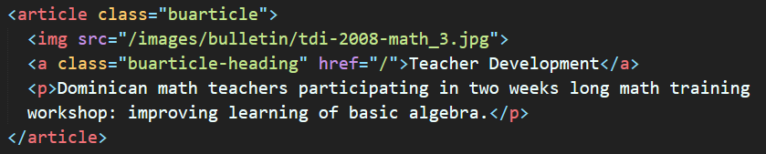
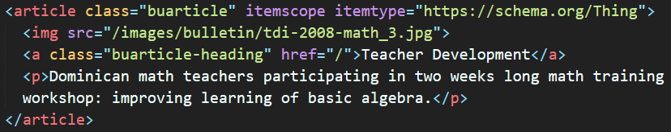

## Qué es *Schema.org*

Schema.org provee una colección de vocabularios compartidos 
que puedes utilizar para que las máquinas de búsqueda puedan entender tu página web.

Veamos un ejemplo:

Aquí tenemos un artículo. Tiene una imagen, un link y un párrafo.

Lo primero que tenemos que hacer es identificar esta sección. Esto lo hacemos añadiendo el elemento *itemscope* en la división. Esto quiere decir que lo que está dentro del bloque es un elemento en particular.

`itemscope` indica que, lo que está dentro del bloque `
...
` 
es un elemento en particular.

Una vez especificado el *itemscope*, añadimos el tipo de elemento. Esto lo hacemos con *itemtype*. Pero, ¿cómo sabemos qué tipo utilizar?

Para esto debemos buscar un itemtype que esté más relacionado con el contenido. En este caso nuestro itemtype puede ser *Thing*; tiene imagen, url y una descripción.

`itemtype` especifica el tipo de elemento que se está utilizando.
se coloca después del `itemscope`.

**Nota:** Schema.org describe una variedad de tipos de elementos, cada uno tiene su conjunto de propiedades que se pueden utilizar para describir el elemento. 
Ir a [Lista de todos los tipos de elementos](https://schema.org/docs/full.html) para ver los detalles.

Ahora debemos añadir las propiedades. Esto lo hacemos con *itemprop*. 

`itemprop` especifica las propiedades del elemento. 

## Tips para utilizar Schema.org

### Algunas notas a tener en cuenta a la hora de utilizar schema.org:

1. Cuanto más contenido marcado, mejor. Pero sólo se debe marcar 
el contenido que sea visible para las personas que visitan la página 
web y no el contenido en `div` ocultos u otros elementos ocultos.

2. A veces el valor de una propiedad de elemento puede ser otro elemento con su propio conjunto de propiedades. 

3. Para páginas con una colección de elementos, se debe marcar cada elemento por separado. 

## Prueba tu Schema.org

Ir a [Structured Data Testing Tool](https://search.google.com/structured-data/testing-tool)
para verificar que el `schema.org` está correctamente implementado.

**Buenos resultados** (sin errores ni advertencias)

**Errores o advertencias**

**Para más información:** [Schema.org](https://schema.org), [Detección social](https://developers.google.com/web/fundamentals/discovery/social-discovery?hl=es)